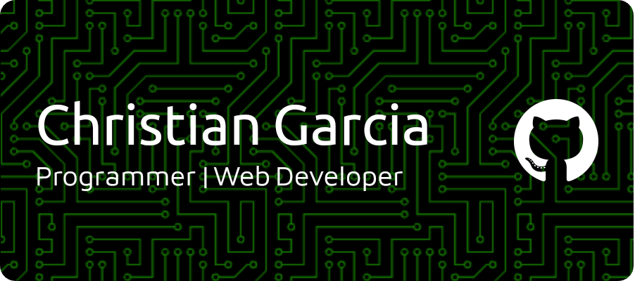

# 

## Socials:
  
 

## How to reach me:

## Current Status:
- 💻 3rd year CS Student
- 🔍 Looking for connections in **Web Development** and **Package Deployment**.
- 💬 Feel free to discuss me about **Machine Learning**, **Web Development**, **Programming** and **Frameworks**. 

## Tools, Languages and Frameworks i work on:

## Connect with me:

## Profile Visits:

