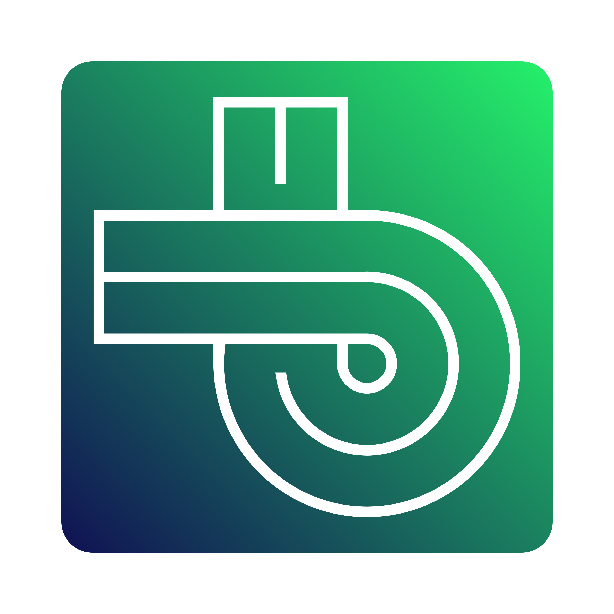

## About Me

>[!NOTE]
>I am a Computer Science student at Surigao del Norte State University with a strong interest in building reliable, efficient, and data-driven systems. I am passionate about backend development and enjoy creating structured solutions that power applications behind the scenes.
>
>I focus on designing well-organized systems, ensuring stability, and improving performance through thoughtful planning and problem-solving. I take pride in writing clean, maintainable solutions and building applications that are both scalable and dependable.
>
>Beyond technical skills, I am curious, analytical, and growth-oriented. I enjoy learning by building practical projects that solve real-world problems and continuously challenge myself to improve. My goal is to become a well-rounded software developer capable of designing intelligent, scalable systems that create meaningful impact.

>[!TIP]
> Always **Building**, Always **Learning**.

## Tech Stack

| Categories | Tools | Categories | Tools
|:---|:---|:---|:---|
| Programming Language |  | API Tester Tool |  |
| Backend Framework |  | Machine Learning & Computer Vision |  |
| Native Runtime |  | Operating System |  |
| Frontend Framework |  | Container |  |
| Databases |  | Web Server & Hosting |  |
| Workstation |  | AI Tools |  |

# Projects

| Project Name | Logo |
|---|---|
| **bridgev3** | |

